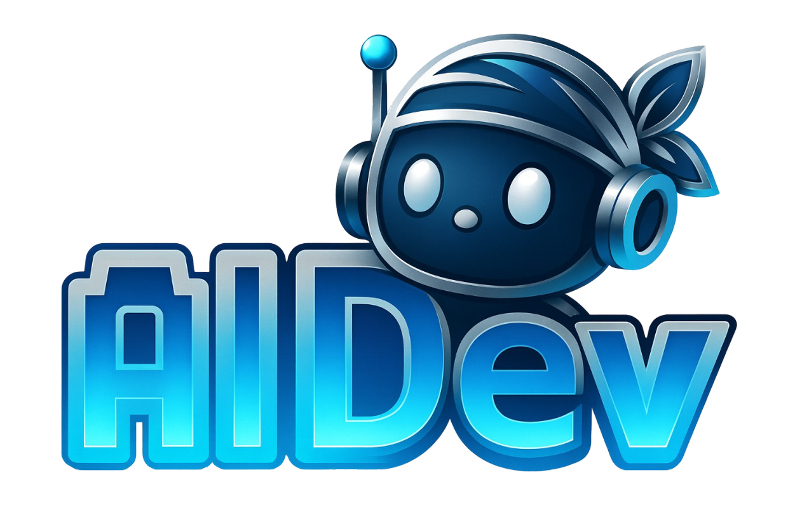
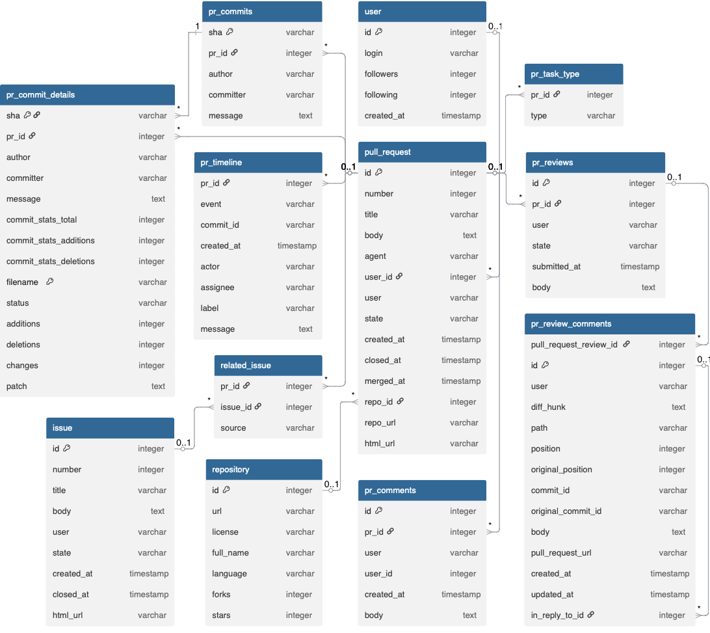

<p align="center">
  
</p>

# Analyzing Review Effort in Human vs. Agentic Pull Requests  
### A Comparative Study

[](https://huggingface.co/datasets/hao-li/AIDev)
[](#)
[](LICENSE)

---

## Author

**Mahmoud Alyosify** School of Computing, Queen's University  
📧 mahmoud.alyosify@queensu.ca  
Course: *CISC839 – Advanced Data Analytics*

---

## Overview

This repository presents a full analytical study on **review effort in AI-generated (agentic) vs. human-authored pull requests (PRs)** across large-scale open-source GitHub repositories.

Using a curated subset of the **AIDev dataset**, the study investigates how AI coding agents reshape review dynamics—not by reducing effort, but by **transforming its nature**.

---

## Core Insight

> Agentic pull requests do not reduce review effort—they redistribute it.  
> The challenge shifts from understanding intent to justifying trust.

---

## Dataset & Schema

- **Source:** [AIDev Dataset (Hugging Face)](https://huggingface.co/datasets/hao-li/AIDev)  
- **Scope:** Filtered subset (**>100 stars repositories**)

| Type          | PR Count |
|---------------|----------|
| Agentic PRs   | 31,284   |
| Human PRs     | 6,149    |
| **Total** | 37,433   |

### Data Structure
Below is the database schema used for the analytical pipeline:

<p align="center">
  
</p>

---

## 📂 Repository Structure

```text
├── notebook/
│   └── notebook_Analyzing Review Effort in Human vs. Agentic Pull Requests.ipynb
├── figs/            # Result visualizations
├── img/             # Documentation assets (Schema, etc.)
├── data/            # Local data subsets
├── requirements.txt 
└── README.md 
```

---

## Key Findings

### ⚡ Speed–Quality Paradox
- Agentic PRs resolve faster (**40.4 hrs vs. 92.97 hrs**)  
- But merge less often (**76.8% vs. 82.6%**)  
- **Insight:** Speed reflects **rejection**, not necessarily efficiency.

### 🤖 Authorship Effect
- AI authorship significantly reduces TTR.
- Suggests **reverse automation bias** (fast dismissal of AI output).

### 📉 Structural Drivers of Review Effort
- Review friction is driven by **architectural dispersion**, not just code size.
- Measured via:
  - **CDI (Cognitive Dispersion Index)**
  - **RICR (Rework-to-Initial Churn Ratio)**

---

## Methodology

1. **Data Engineering:** Construction of TTR, CDI, and RICR indices.
2. **Statistical Testing:** Welch’s t-test (handling unequal variance).
3. **Regression Modeling:** OLS with HC3 robust errors to isolate AI effect.
4. **GenAI-Augmented Reanalysis:** Logistic regression revealing the **fast-rejection dynamic**.

---

## Reproducibility

Install dependencies:
```bash
pip install -r requirements.txt
```

The dataset loads directly via Hugging Face:
`hf://datasets/hao-li/AIDev/`

---

## ⚠️ Limitations
- Observational data may contain unobserved confounders.
- TTR mixes active review time with idle queue time.

MIT License  
© 2026 Mahmoud Sayed Youssef

## 🙏 Acknowledgment
This work builds upon the AIDev dataset:
*Li et al. (2025). The Rise of AI Teammates in Software Engineering (SE) 3.0.*
